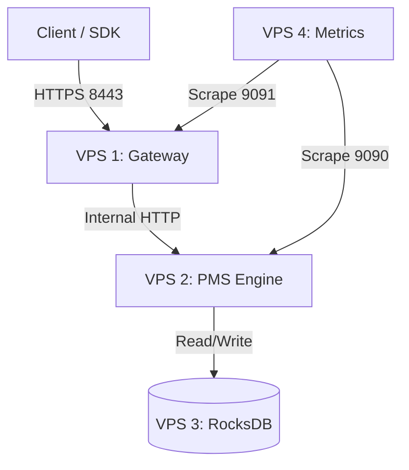

# PMS Node (DAG Protocol)

**Planetary Monetary System (PMS)** est une infrastructure de valeur numérique basée sur un **DAG centralisé, privé et haute performance**.

> [!IMPORTANT]
> PMS **n'est pas** une blockchain publique, n'est **pas trustless** et n'est **pas** un projet idéologique.

Le système est **custodial par design** : l'autorité de validation et de gouvernance appartient à l'entreprise qui opère le réseau. Les nœuds sont privés et contrôlés en interne ou par des partenaires explicitement autorisés.

### 🎯 Cas d'Usage
- Économies fermées (gaming, plateformes internes)
- Wallets custodial
- Core banking privé
- Plateformes financières internes

### ⚡ Performance
- **4000+ TPS** (transactions par seconde)
- Architecture lock-free
- Stockage RocksDB optimisé SSD

---

## 🛡️ Priorités du Projet

| # | Priorité | Description |
|---|----------|-------------|
| 1 | **Correctness** | Règles explicites, validation serveur stricte, cohérence comptable |
| 2 | **Sécurité** | Autorité claire, rôles, permissions, journalisation complète |
| 3 | **Performance** | Faible latence, haut débit, simplicité opérationnelle |
| 4 | **Architecture** | Séparation stricte des responsabilités (Gateway, Engine, Storage) |

### ⚠️ Principes Non Négociables
- Le **serveur est l'autorité finale** de validation (Single Writer).
- Le DAG n'est **jamais exposé directement au public**.
- Tout accès passe par le **Gateway**.

---

## 🌟 Architecture 4-VPS (Production)

L'architecture est strictement divisée en 4 services mandataires pour garantir la sécurité et la performance :



### Services
1.  **VPS 1: Gateway (Port 8443)**
    *   **Seul point d'entrée public**.
    *   Gère le Rate Limiting (DoS protection).
    *   Terminaison TLS.
    *   Proxy vers l'Engine interne.

2.  **VPS 2: PMS Engine (Internal Only)**
    *   **Cœur du système**.
    *   Coordinateur Single Writer (valide et ordonne les blocs).
    *   Aucun accès public direct.

3.  **VPS 3: Stockage (RocksDB)**
    *   Volume persistant haute performance (NVMe recommandé).

4.  **VPS 4: Monitoring (Prometheus)**
    *   Collecte les métriques techniques et métier.

---

## 🚀 Installation & Déploiement (Docker)

Le déploiement se fait via **Docker Compose** orchestrant les 4 services.

### Prérequis
*   Docker & Docker Compose.

### Démarrage Rapide (Test Environment)

Utilisez le script unifié pour lancer la stack 4-VPS en local :

```bash
./scripts/docker_test.sh setup
```

Ce script va :
1.  Générer les certificats TLS et clés.
2.  Builder les images `pms-gateway` et `pms-node`.
3.  Lancer le cluster complet.

### Vérification

*   **Statut du Cluster** : `./scripts/docker_test.sh status`
*   **Santé Gateway** : `curl -k https://127.0.0.1:8443/livez`

---

## ⚙️ Configuration

L'architecture repose sur des variables d'environnement et des fichiers de configuration TOML.

### Gateway (Env Vars)
*   `LISTEN_ADDR`: 0.0.0.0:8443
*   `UPSTREAM_URL`: URL de l'Engine interne
*   `TLS_CERT` / `TLS_KEY`: Chemins des certificats

### Engine (config.toml)
*   Mode Single Writer activé.
*   Validation centralisée.
*   Stockage RocksDB.

---

## 🧪 Tests E2E

Pour vérifier le bon fonctionnement de la stack complète (via le Gateway) :

```bash
cargo test -p pms-server --test distributed_tx_e2e -- --ignored --nocapture
```

---

## 📖 Documentation API

Toute interaction se fait via le **Gateway (Port 8443)**.

### Endpoints Principaux

| Méthode | Endpoint | Description |
| :--- | :--- | :--- |
| `GET` | `/v1/tips` | Récupérer les derniers blocs (Tips) |
| `GET` | `/v1/utxos/{address}` | Récupérer les UTXOs d'une adresse |
| `POST` | `/submit/block` | Soumettre un nouveau bloc (Transaction) |
| `GET` | `/v1/blocks/{id}` | Lire le contenu d'un bloc |

---

## 🛠 Observabilité

*   **Endpoint Métriques** : `/metrics` (sur Gateway :9091 et Engine :9090)
*   **Logs** : JSON structuré (`RUST_LOG=info`).

---

## 📦 SDK TypeScript

Le SDK officiel est configuré pour parler au Gateway.

```bash
npm install @pms/sdk
```

```typescript
// Connecter au Gateway
const client = new PmsClient({ nodeUrl: "https://gateway.pms.network:8443" });
```
