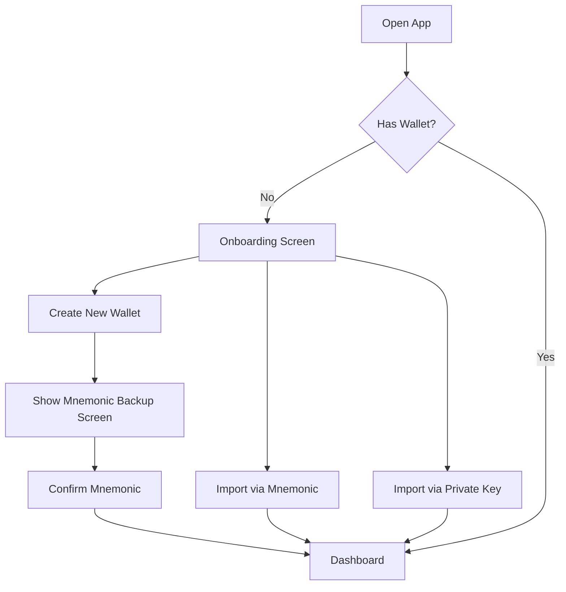
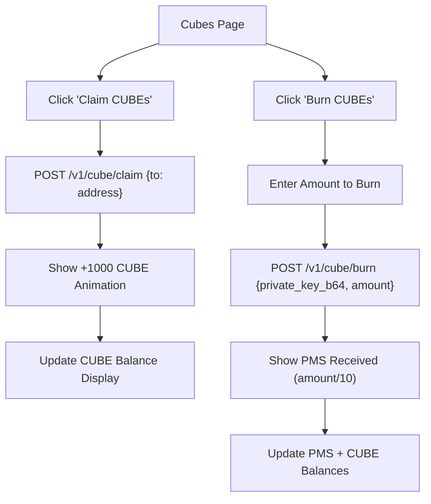
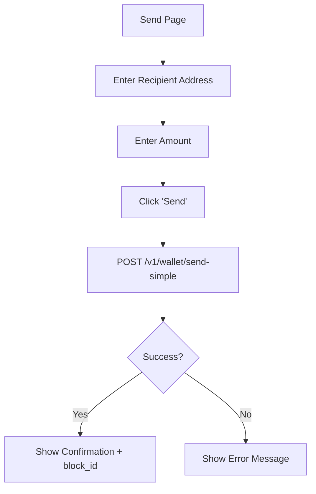
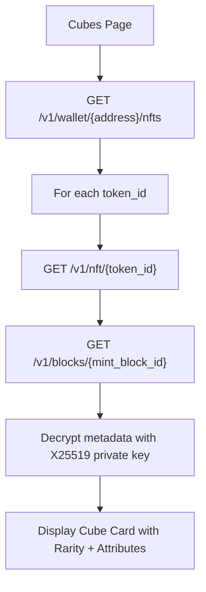

# 🖥️ PMS Client Dashboard — Specification

> **Purpose**: This document is a complete, self-contained specification for building the PMS Client Dashboard.
> An agent (or developer) reading this file should have **everything** needed to implement the dashboard from scratch, without needing to read any other source file in this repository.

---

## 1. Product Overview

The **Client Dashboard** is a web application that allows end-users (non-admins) to interact with the PMS (Planetary Monetary System) network. It is the consumer-facing counterpart to the existing **Admin Dashboard** (`pms-dashboard/`).

### 1.1 Core Value Proposition
Users can:
1. **Create or import a wallet** (keypair management).
2. **View their PMS balance** and transaction history.
3. **Send PMS tokens** to other addresses.
4. **Interact with Cubes** — claim, view, and burn Cube tokens to earn PMS.
5. **View owned NFTs** (Cubes) with decrypted metadata (rarity, attributes).

### 1.2 Non-Goals (Out of Scope for V1)
- Admin operations (ledger management, fee distribution, compliance).
- Token creation (`/admin/tokens/create`).
- Bridge operations.
- P2P node management.
- Staking/DeFi features.

---

## 2. Architecture

### 2.1 System Context

```
┌─────────────────────┐       HTTPS        ┌─────────────────┐     Internal     ┌──────────────┐
│   Client Dashboard  │ ──────────────────► │   PMS Gateway   │ ──────────────── │  PMS Engine   │
│   (Browser SPA)     │   Port 8443         │   (Reverse Proxy)│                  │ (Coordinator) │
│                     │                     │                 │                  │              │
│  Uses: @pms/sdk     │                     │                 │                  │  RocksDB     │
└─────────────────────┘                     └─────────────────┘                  └──────────────┘
```

### 2.2 Tech Stack (Recommended)
| Layer | Technology | Rationale |
|-------|-----------|-----------|
| **Framework** | Vite + Svelte 5 (or React/Vue) | Lightweight, fast, ecosystem maturity |
| **SDK** | `@pms/sdk` (in `sdk/` folder) | Already built, handles crypto + API calls |
| **Styling** | Vanilla CSS (dark theme) | Per project guidelines — no Tailwind |
| **Charts** | Chart.js (already a dep) | Consistency with admin dashboard |
| **Key Storage** | `localStorage` (V1), encrypted | For MVP; eventual upgrade to Web Crypto API |

### 2.3 Local SDK Usage
The `@pms/sdk` package lives in `./sdk/` at the repository root. Install it via a relative path:
```json
{
  "dependencies": {
    "@pms/sdk": "file:../sdk"
  }
}
```

---

## 3. SDK Reference (`@pms/sdk`)

The SDK is already fully implemented and tested. Here is the complete public API the dashboard should use.

### 3.1 Wallet Management (`PmsWallet`)

```typescript
import { PmsWallet, isValidMnemonic } from "@pms/sdk";

// Generate new wallet (24-word mnemonic)
const wallet = PmsWallet.generate();
wallet.mnemonic;           // "word1 word2 ... word24"
wallet.address;            // "04abc123..." (public key hex, uncompressed)
wallet.publicKeyHex;       // Same as address
wallet.x25519PublicKeyHex; // X25519 public key for encryption

// Restore from mnemonic
const restored = PmsWallet.fromMnemonic("word1 word2 ... word24");

// Import from private key (hex)
const imported = PmsWallet.fromPrivateKey("abc123...");

// Import from seed (32 bytes)
const seeded = PmsWallet.fromSeed(new Uint8Array(32));

// Export private key
const privateKey: string = wallet.exportPrivateKey();

// Sign a message
const signature: string = wallet.sign(messageBytes);

// Verify signature (static)
const isValid: boolean = PmsWallet.verify(message, signature, publicKeyHex);

// Validate mnemonic
isValidMnemonic("word1 word2 ..."); // boolean
```

> **Crypto stack**: `secp256k1` (ECDSA, DER-encoded), `X25519` for key exchange, `AES-256-GCM` for symmetric encryption.

### 3.2 Client API (`PmsClient`)

```typescript
import { PmsClient } from "@pms/sdk";

const client = new PmsClient({
  nodeUrl: "https://node.pms.network",  // Gateway URL (port 8443 in dev)
  seedNodes: [],                        // Optional fallback nodes
  networkId: "pms-mainnet",             // or "pms-testnet"
  protocolVersion: 1,
  timeout: 30000,                       // ms
  enableRacing: true,                   // Parallel submission to multiple nodes
});
```

#### Read Operations

| Method | Returns | Description |
|--------|---------|-------------|
| `client.getTips()` | `string[]` | Latest DAG tip block IDs |
| `client.getBlock(blockId)` | `Block` | Full block by ID |
| `client.getSupply()` | `SupplyInfo` | Circulating supply stats |
| `client.getUtxos(address)` | `Utxo[]` | UTXO set for an address |
| `client.getBalance(address)` | `string` | Balance as decimal string |
| `client.getBalanceInfo(address)` | `BalanceInfo` | Balance + detailed UTXOs |
| `client.getHistory(address, opts)` | `WalletHistoryResp` | Transaction history |

#### Write Operations

```typescript
// Simple send (builds, signs, submits in one call)
const result = await client.send({
  to: "04recipient...",
  amount: "10.0",
  wallet: myWallet,
  memo: "Optional memo",
});
// result: { status: "inserted", block_id: "7f3a2b1c..." }
```

#### NFT/Cube Operations

```typescript
// Mint a Cube (via Authority backend)
const cube = await client.mintCube({
  wallet: myWallet,
  generatorUrl: "https://cube-generator.example.com",
});
// cube: { status, block_id, token_id, rarity, roll, attributes: { weight, size, density } }

// Burn a single NFT
const burn = await client.burnNft({
  tokenId: "nft-id",
  wallet: ownerWallet,
});
// burn: { status, block_id, refund: { amount, recipient } }

// Batch burn
const batchBurn = await client.burnNfts({
  tokenIds: ["t1", "t2", "t3"],
  wallet: ownerWallet,
});

// Standard NFT mint
const nft = await client.mintNft({
  tokenId: "unique-nft-001",
  metadata: { name: "Mon NFT", description: "...", uri: "ipfs://...", nft_type: "art" },
  wallet: myWallet,
});
```

### 3.3 Utility Functions

```typescript
import { parseAmount, formatAmount, toHex, fromHex } from "@pms/sdk";

parseAmount("10.5");      // 1050000000n  (bigint, 8 decimals)
formatAmount(1050000000n); // "10.50000000"
toHex(new Uint8Array([1,2,3])); // "010203"
fromHex("010203"); // Uint8Array
```

---

## 4. REST API Endpoints (Direct, if not using SDK)

All endpoints are served by the **Gateway** (HTTPS, port 8443 in dev).

### 4.1 Wallet

| Method | Endpoint | Description | Auth |
|--------|----------|-------------|------|
| `POST` | `/v1/wallet/create` | Generate or import wallet | None |
| `POST` | `/v1/balance` | Get balance (no decryption) | None |
| `POST` | `/wallet/balance` | Get balance with UTXO decryption | Keys in body |
| `GET`  | `/v1/wallet/{address}/utxos` | List UTXOs | None |
| `POST` | `/wallet/history` | Transaction history | None |
| `POST` | `/v1/wallet/send-simple` | Custodial send (server signs) | Private key in body |
| `POST` | `/wallet/tx/send` | Send pre-signed WireBlock | Signature in block |

#### Create Wallet — `POST /v1/wallet/create`
```json
// Request (empty body = generate new)
{}
// OR import existing:
{ "import_hex": "private_key_hex" }

// Response
{
  "address": "pms1qw508d6...",         // Bech32 address
  "private_key_b64": "MHQCAQEEIFm0...", // Private key base64
  "public_key_hex": "04abc123...",       // ECDSA public key
  "x25519_pub_hex": "def456..."          // Encryption key
}
```

#### Get Balance — `POST /wallet/balance`
```json
// Request
{
  "bech32_addr": "pms1abc123...",
  "x25519_sk_hex": "private_x25519_hex",
  "ecdsa_pk_hex": "04abc123...",
  "scan_limit": 2000
}
// Response
{ "balance": "1234.56789012", "utxos": [...] }
```

#### Send Simple — `POST /v1/wallet/send-simple`
```json
// Request
{
  "private_key_b64": "MHQCAQEEIFm0...",
  "to": "pms1recipient...",
  "amount": "100.0",
  "asset_id": null  // null = native PMS
}
// Response (201)
{ "block_id": "tx_abc123...", "fee": "0.03000000" }
```

### 4.2 Cube System

| Method | Endpoint | Description |
|--------|----------|-------------|
| `POST` | `/v1/cube/claim` | Claim 1000 CUBE tokens (mining simulation) |
| `POST` | `/v1/cube/burn` | Burn CUBE tokens → receive PMS (10 CUBE = 1 PMS) |

#### Claim CUBEs — `POST /v1/cube/claim`
```json
// Request
{ "to": "pms1recipient..." }
// Response (201)
{ "block_id": "claim_abc...", "amount": "1000.00", "asset_id": "cube" }
```

#### Burn CUBEs — `POST /v1/cube/burn`
```json
// Request
{ "private_key_b64": "MHQCAQEEIFm0...", "amount": "500.00" }
// Response (201)
{ "block_id": "burn_def...", "cubes_burned": "500.00", "pms_received": "50.00000000" }
```

### 4.3 NFTs

| Method | Endpoint | Description |
|--------|----------|-------------|
| `GET`  | `/v1/wallet/{address}/nfts` | List owned NFT token IDs |
| `GET`  | `/v1/nft/{token_id}` | Get NFT info (owner, exists) |
| `POST` | `/v1/nft/mint` | Mint NFT (Coordinator-signed) |
| `POST` | `/v1/nft/burn` | Burn NFT (owner only) |
| `POST` | `/v1/nft/transfer/prepare` | Prepare NFT transfer (re-encryption) |

#### List Owned NFTs — `GET /v1/wallet/{address}/nfts`
```json
// Response
{ "owner": "pms1abc...", "token_ids": ["cube_001", "cube_002"], "count": 2 }
```

### 4.4 Network Info

| Method | Endpoint | Description |
|--------|----------|-------------|
| `GET`  | `/v1/supply` | Circulating supply, minted, burned |
| `GET`  | `/v1/tokens` | List registered tokens |
| `GET`  | `/v1/tokens/{asset_id}` | Token details |
| `GET`  | `/blocks/stream` | SSE stream of new blocks (real-time) |
| `GET`  | `/v1/fee_pool` | Fee pool status |

### 4.5 Amounts & Precision
All monetary amounts are **strings** with up to **8 decimal places**.
Use `BigInt` or a decimal library — **never** floating-point arithmetic.

---

## 5. Data Models

### 5.1 Key Types

```typescript
// Wallet info (stored locally)
interface WalletData {
  address: string;            // Bech32 "pms1..."
  publicKeyHex: string;       // "04..." (uncompressed secp256k1)
  x25519PubHex: string;       // X25519 encryption key
  privateKeyB64: string;      // Base64-encoded private key (SENSITIVE)
  mnemonic?: string;          // 24-word mnemonic (SENSITIVE)
  label?: string;             // User-defined name
}

// Balance response
interface BalanceInfo {
  balance: string;            // "1234.56789012"
  utxos: Utxo[];
}

interface Utxo {
  address: string;
  amount: string;
  outpoint: { txid: string; index: number };
}

// History item
interface HistoryItem {
  block_id: string;
  ts_ms: number;              // Unix timestamp ms
  payload_type: "TxUtxo" | "Mint" | "Reward" | "EncryptedReward" | "Nft";
  payload: any;
}

// Supply info
interface SupplyInfo {
  circulating_supply: string;
  total_minted: string;
  total_burned: string;
  last_update_ts: number;
}

// Cube rarity tiers
type CubeRarity = "Unique" | "Legendary" | "Rare" | "Uncommon" | "Common" | "Basic";

interface CubeAttributes {
  weight: number;  // grams
  size: number;    // mm
  density: number; // g/cm³
}
```

### 5.2 Rarity Distribution

| Rarity | Probability | Per 10M Cubes |
|--------|-------------|---------------|
| Unique | 1/1,000,000 | 10 |
| Legendary | 1/100,000 | 100 |
| Rare | 1/10,000 | 1,000 |
| Uncommon | 1/1,000 | 10,000 |
| Common | 1/100 | 100,000 |
| Basic | ~99% | ~9,888,890 |

### 5.3 Burn Refund Formula (for NFT Cubes)
```
refund_pms = (weight_g × size_mm × density_x100) / 19,300,000,000
```

### 5.4 CUBE Token Conversion Rate
```
10 CUBE tokens = 1 PMS
```

---

## 6. User Flows & Pages

### 6.1 Page Map

```
/                    → Landing / Onboarding (if no wallet)
/dashboard           → Main dashboard (balance, quick actions)
/wallet              → Wallet details (UTXOs, address, export)
/send                → Transfer form
/history             → Transaction history
/cubes               → Cube management (claim, view, burn)
/cubes/:id           → Single cube detail (attributes, rarity)
/settings            → Wallet management (switch, delete, backup)
```

### 6.2 Flow: First-Time User



### 6.3 Flow: Claim & Burn CUBEs



### 6.4 Flow: Send PMS



### 6.5 Flow: View NFT Cubes



---

## 7. UI/UX Specification

### 7.1 Design System

| Token | Value | Usage |
|-------|-------|-------|
| `--bg-primary` | `#0a0a0f` | Page background |
| `--bg-card` | `rgba(255, 255, 255, 0.04)` | Glass card background |
| `--bg-card-hover` | `rgba(255, 255, 255, 0.08)` | Card hover state |
| `--border` | `rgba(255, 255, 255, 0.08)` | Card borders |
| `--accent` | `#8b5cf6` | Primary accent (purple) |
| `--accent-gradient` | `linear-gradient(135deg, #6d28d9, #a855f7)` | Gradient accents |
| `--success` | `#10b981` | Positive values, successful txs |
| `--error` | `#ef4444` | Errors, negative values |
| `--warning` | `#f59e0b` | Warnings |
| `--fg-primary` | `#fafafa` | Primary text |
| `--fg-secondary` | `#a1a1aa` | Secondary/muted text |
| **Font** | `Inter, system-ui, sans-serif` | Import from Google Fonts |
| **Mono Font** | `JetBrains Mono, monospace` | Addresses, amounts, hashes |
| **Border Radius** | `12px` (cards), `8px` (inputs), `99px` (badges) | Consistent rounding |

### 7.2 Component Guidelines

**Glass Card** (`.glass-panel`):
```css
.glass-panel {
  background: rgba(255, 255, 255, 0.04);
  border: 1px solid rgba(255, 255, 255, 0.08);
  border-radius: 12px;
  padding: 1.5rem;
  backdrop-filter: blur(20px);
}
```

**Rarity Colors** (for Cube cards):
| Rarity | Color | Glow Effect |
|--------|-------|-------------|
| Unique | `#ff6b6b` (Red) | Strong pulsating glow |
| Legendary | `#ffd700` (Gold) | Medium glow |
| Rare | `#a855f7` (Purple) | Subtle glow |
| Uncommon | `#3b82f6` (Blue) | Faint glow |
| Common | `#10b981` (Green) | No glow |
| Basic | `#6b7280` (Gray) | No glow |

**Micro-animations**:
- Balance update: Number counter animation (count up/down).
- New transaction: Slide-in from right with fade.
- Cube claim: Particle burst + scale animation on the "+1000 CUBE" text.
- Burn: Dissolve/fire animation on the cube card.

### 7.3 Responsive Breakpoints
| Breakpoint | Layout |
|-----------|--------|
| `>= 1280px` | 3-column grid |
| `>= 768px` | 2-column grid |
| `< 768px` | Single column, bottom nav |

---

## 8. Security Considerations

### 8.1 Key Storage (V1 — MVP)
- Store `privateKeyB64` and `mnemonic` in `localStorage` (encrypted with a user-defined PIN).
- **Never** log or transmit private keys except to `send-simple` endpoint (which is custodial).
- Offer "Export" and "Clear Data" options prominently.

### 8.2 Future Improvements (V2+)
- Web Crypto API for key derivation and storage.
- Hardware wallet support (Ledger/Trezor).
- Non-custodial mode: use `/v1/tx/prepare` → sign locally → `/wallet/tx/send` instead of `send-simple`.

### 8.3 HTTPS
- All API calls MUST use HTTPS in production.
- In dev, use `https://localhost:8443` with `rejectUnauthorized: false` (self-signed certs).

---

## 9. State Management

### 9.1 Stores (Svelte example, adapt for React/Vue)

```typescript
// stores/wallet.ts
export const currentWallet = writable<WalletData | null>(null);
export const walletList = writable<WalletData[]>([]);

// stores/balance.ts
export const pmsBalance = writable<string>("0.00000000");
export const cubeBalance = writable<string>("0.00");
export const utxos = writable<Utxo[]>([]);

// stores/history.ts
export const transactions = writable<HistoryItem[]>([]);

// stores/nfts.ts
export const ownedNfts = writable<NftDisplay[]>([]);

// stores/network.ts
export const supplyInfo = writable<SupplyInfo | null>(null);
export const connected = writable<boolean>(false);
```

### 9.2 Refresh Strategy
| Data | Interval | Trigger |
|------|----------|---------|
| Balance | 10s polling | Also on send/burn/claim |
| History | 30s polling | Also on send/burn/claim |
| NFTs | On-demand | On page visit + after mint/burn |
| Supply | 60s polling | Background |
| SSE Blocks | Real-time stream | EventSource |

---

## 10. Development Setup

### 10.1 Project Init (Vite + Svelte)
```bash
# From the repo root, create new project
mkdir pms-client && cd pms-client
npx -y create-vite@latest ./ --template svelte-ts

# Install the local SDK
npm install ../sdk

# Install chart.js (for optional charts)
npm install chart.js

# Run dev server
npm run dev
```

### 10.2 Vite Config — API Proxy
```typescript
// vite.config.ts
import { defineConfig } from 'vite';
import { svelte } from '@sveltejs/vite-plugin-svelte';

export default defineConfig({
  plugins: [svelte()],
  server: {
    port: 3000,
    proxy: {
      '/api': {
        target: 'https://localhost:8443',
        changeOrigin: true,
        secure: false, // Self-signed certs
        rewrite: (path) => path.replace(/^\/api/, ''),
      },
    },
  },
});
```

### 10.3 Docker Integration
The client dashboard should be served by a static file server (Nginx/Caddy) or bundled into the existing `Caddyfile.prod`. It does **not** need its own Docker container — it's a static SPA.

---

## 11. Testing Checklist

### 11.1 E2E Flow Test
- [ ] Create a new wallet → mnemonic is shown
- [ ] Restore wallet from mnemonic → same address
- [ ] Import wallet from private key → same address
- [ ] View balance (0 PMS initially)
- [ ] Claim 1000 CUBEs → CUBE balance updates
- [ ] Burn 100 CUBEs → receive 10 PMS, CUBE balance -= 100
- [ ] Send 5 PMS to another address → balance -= (5 + fee)
- [ ] View transaction history → shows send TX
- [ ] View owned NFTs (if any)

### 11.2 Error Handling
- [ ] Send with insufficient balance → shows clear error
- [ ] Invalid recipient address → validation before API call
- [ ] Network down → shows "Disconnected" banner
- [ ] Invalid mnemonic import → shows error, doesn't crash

---

## 12. File Structure (Recommended)

```
pms-client/
├── index.html
├── package.json
├── vite.config.ts
├── tsconfig.json
├── src/
│   ├── main.ts
│   ├── App.svelte
│   ├── app.css                    # Global styles + design tokens
│   ├── stores/
│   │   ├── wallet.ts
│   │   ├── balance.ts
│   │   ├── history.ts
│   │   ├── nfts.ts
│   │   └── network.ts
│   ├── lib/
│   │   ├── api.ts                 # Thin wrapper around @pms/sdk
│   │   └── storage.ts             # localStorage helpers
│   ├── pages/
│   │   ├── Onboarding.svelte
│   │   ├── Dashboard.svelte
│   │   ├── Send.svelte
│   │   ├── History.svelte
│   │   ├── Cubes.svelte
│   │   ├── CubeDetail.svelte
│   │   └── Settings.svelte
│   └── components/
│       ├── BalanceCard.svelte
│       ├── TxItem.svelte
│       ├── CubeCard.svelte
│       ├── NavBar.svelte
│       ├── Modal.svelte
│       └── Toast.svelte
└── public/
    └── favicon.svg
```

---

## 13. Existing Codebase Reference

| What | Path | Notes |
|------|------|-------|
| TypeScript SDK | `sdk/` | `@pms/sdk` — use as dependency |
| API Documentation | `documentation/api/` | 15 markdown files per endpoint group |
| Admin Dashboard | `pms-dashboard/` | Svelte 5 + Vite — use as style reference |
| Admin CSS | `pms-dashboard/src/app.css` | Design tokens to reuse |
| E2E Test | `crates/pms-server/tests/e2e_prod_sim.rs` | Shows full mint→burn→transfer flow |
| Config Templates | `etc/config/` | TOML configs for Gateway + Engine |
| Docker Compose | `docker-compose.yml` | Dev environment setup |
| Docker Compose Testnet | `docker-compose.testnet.yml` | Testnet environment |

---

## 14. Appendix: Endpoint Quick Reference

```
# Wallet
POST   /v1/wallet/create              → Create/import wallet
POST   /v1/balance                     → Simple balance check
POST   /wallet/balance                 → Balance with decryption
GET    /v1/wallet/{addr}/utxos         → UTXO list
POST   /wallet/history                 → Transaction history
POST   /v1/wallet/send-simple          → Custodial send
POST   /wallet/tx/send                 → Send signed WireBlock

# CUBEs
POST   /v1/cube/claim                  → Claim 1000 CUBE
POST   /v1/cube/burn                   → Burn CUBE → PMS

# NFTs
GET    /v1/wallet/{addr}/nfts          → List owned NFTs
GET    /v1/nft/{token_id}              → NFT details
POST   /v1/nft/mint                    → Mint NFT
POST   /v1/nft/burn                    → Burn NFT
POST   /v1/nft/transfer/prepare        → Prepare NFT transfer

# Network
GET    /v1/supply                      → Supply stats
GET    /v1/fee_pool                    → Fee pool status
GET    /v1/tokens                      → Token registry
GET    /v1/tokens/{asset_id}           → Token details
GET    /blocks/stream                  → SSE block stream
```
